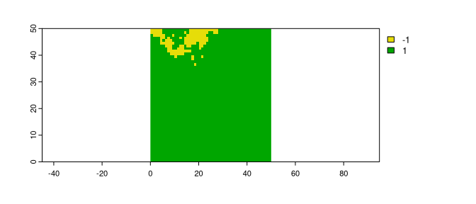

<!-- README.md is generated from README.Rmd. Please edit that file -->

# spatialising

<!-- badges: start -->

[](https://app.codecov.io/gh/Nowosad/spatialising?branch=main)
[](https://lifecycle.r-lib.org/articles/stages.html#experimental)
[](https://github.com/Nowosad/spatialising/actions/workflows/R-CMD-check.yaml)
<!-- badges: end -->

The goal of spatialising is to perform simulations of spatial raster
data using the Ising model.

## Installation

You can install the development version of spatialising from
[GitHub](https://github.com/) with:

``` r
# install.packages("devtools")
devtools::install_github("Nowosad/spatialising")
```

## Example

``` r
library(terra)
#> terra 1.5.24
library(spatialising)
r1 = rast(system.file("raster/r_start.tif", package = "spatialising"))
plot(r1)
```



``` r
r2 = spatial_ising(r1, B = -0.3, J = 0.7)
plot(r2)
```


``` r
ri1 = spatial_ising(r1, B = -0.3, J = 0.7, timesteps = 9)
plot(ri1)
```


``` r
ri2 = spatial_ising(r1, B = 0.3, J = 0.7, timesteps = 9)
plot(ri2)
```


``` r
ri3 = spatial_ising(r1, B = -0.3, J = 0.4, timesteps = 9)
plot(ri3)
```


## Contribution

Contributions to this package are welcome - let us know if you have any
suggestions or spotted a bug. The preferred method of contribution is
through a GitHub pull request. Feel also free to contact us by creating
[an issue](https://github.com/nowosad/spatialising/issues).
