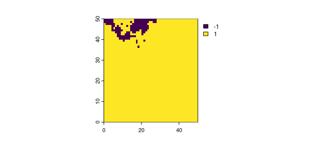
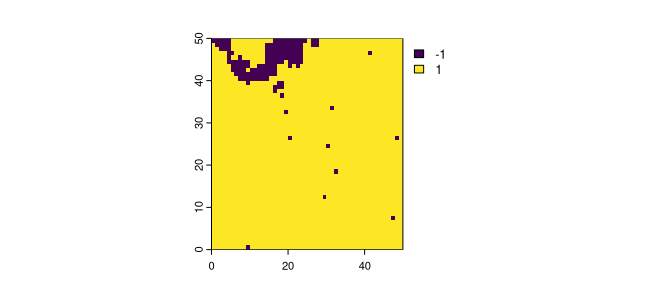
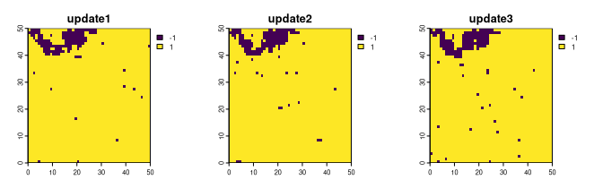
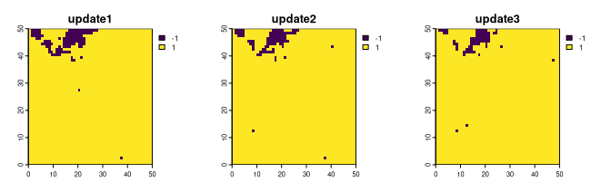
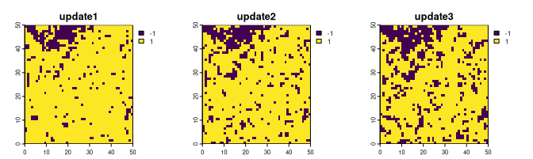

<!-- README.md is generated from README.Rmd. Please edit that file -->

# spatialising

<!-- badges: start -->

[](https://app.codecov.io/gh/Nowosad/spatialising?branch=main)
[](https://lifecycle.r-lib.org/articles/stages.html#experimental)
[](https://github.com/Nowosad/spatialising/actions/workflows/R-CMD-check.yaml)
<!-- badges: end -->

The goal of **spatialising** is to perform simulations of binary spatial
raster data using the Ising model.

## Installation

You can install the development version of **spatialising** from
[GitHub](https://github.com/) with:

``` r
# install.packages("devtools")
devtools::install_github("Nowosad/spatialising")
```

## Example

The **spatialising** package expects raster data with just two values,
`-1` and `1`. Here, we will use the `r_start.tif` file built in the
package.

``` r
library(spatialising)
library(terra)
r1 = rast(system.file("raster/r_start.tif", package = "spatialising"))
plot(r1)
```



Most of the raster area is covered with the value of `1`, and just about
5% of the area is covered with the value of `-1`. The main function in
this package is `kinetic_ising()`. It accepts the input raster and at
least two additional parameters: `B` – representing external pressure
and `J` – representing the strength of the local autocorrelation
tendency. The output is a raster modified based on the provided
parameters.

``` r
r2 = kinetic_ising(r1, B = -0.3, J = 0.7)
plot(r2)
```



The `kinetic_ising()` function also has a fourth argument called
`updates`. By default, it equals to `1`, returning just one raster as
the output. However, when given a value larger than one, it returns many
rasters. Each new raster is the next iteration of the Ising model of the
previous one.

``` r
ri1 = kinetic_ising(r1, B = -0.3, J = 0.7, updates = 3)
plot(ri1, nr = 1)
```



Obtained results depend greatly on the set values of `B` and `J`. In the
example above, values of `B = -0.3` and `J = 0.7` resulted in expansion
of the yellow category (more `-1` values).

On the other hand, values of `B = 0.3` and `J = 0.7` give a somewhat
opposite result with less cell with the yellow category:

``` r
ri2 = kinetic_ising(r1, B = 0.3, J = 0.7, updates = 3)
plot(ri2, nr = 1)
```



Finally, in the last example, we set values of `B = -0.3` and `J = 0.4`.
Note that the result shows much more prominent data change, with a
predominance of the yellow category only after a few updates.

``` r
ri3 = kinetic_ising(r1, B = -0.3, J = 0.4, updates = 3)
plot(ri3, nr = 1)
```



## Documentation

Read the related article:

1.  Stepinski, T. F. & Nowosad, J. (2023). The kinetic Ising model
    encapsulates essential dynamics of land pattern change, Royal
    Society Open Science, <https://doi.org/10.1098/rsos.231005>

## Contribution

Contributions to this package are welcome - let us know if you have any
suggestions or spotted a bug. The preferred method of contribution is
through a GitHub pull request. Feel also free to contact us by creating
[an issue](https://github.com/nowosad/spatialising/issues).
